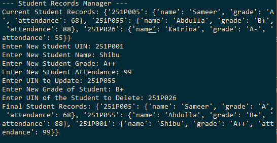

# AIM: Write a Python program to create, update, and manipulate a dictionary of student records, including their grades and attendance.


## Input
```
Enter New Student UIN: 251P001
Enter New Student Name: Shibu
Enter New Student Grade: A++
Enter New Student Attendance: 99
Enter UIN to Update: 251P055
Enter New Grade of Student: B+
Enter UIN of the Student to Delete: 251P026
```

## Output
```
Final Student Records: {'251P005': {'name': 'Sameer', 'grade': 'A', 'attendance': 68}, '251P055': {'name': 'Abdulla', 'grade': 'B+', 'attendance': 88}, '251P001': {'name': 'Shibu', 'grade': 'A++', 'attendance': 99}}
```

## Sample Output
